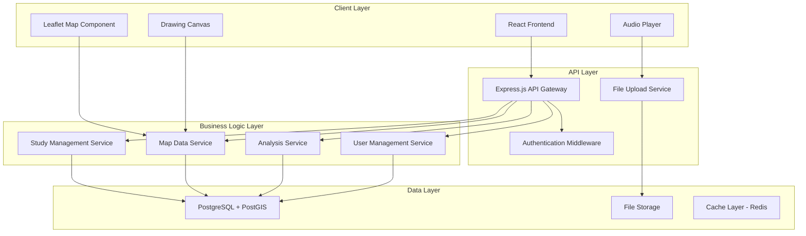
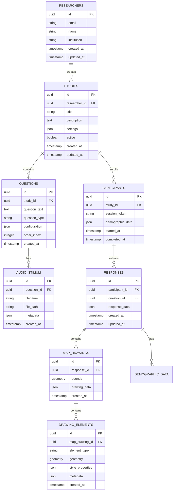

# Design-Dokument - Mental Maps Anwendung

## Übersicht

Die Mental Maps-Anwendung ist eine webbasierte Plattform für sprachwissenschaftliche Forschung, die es ermöglicht, digitale Mental Maps zu erstellen und zu analysieren. Die Anwendung kombiniert interaktive Kartenfunktionen mit Audio-Stimuli, erweiterten Zeichenwerkzeugen und umfassenden Analysemöglichkeiten.

### Technologie-Stack

- **Frontend:** React.js mit TypeScript
- **Kartenbibliothek:** Leaflet.js mit OpenStreetMap
- **Zeichenfunktionen:** Fabric.js für Canvas-basierte Interaktionen
- **Audio:** Web Audio API
- **Backend:** Node.js mit Express.js
- **Datenbank:** PostgreSQL mit PostGIS für Geodaten
- **Dateispeicher:** AWS S3 oder lokaler Speicher für Audio-Dateien
- **Authentifizierung:** JWT-basierte Authentifizierung

## Architektur

### System-Architektur



### Datenbank-Schema



## Komponenten und Schnittstellen

### Frontend-Komponenten

#### 1. Forscher-Dashboard
```typescript
interface ResearcherDashboard {
  studies: Study[];
  createStudy(): void;
  editStudy(studyId: string): void;
  viewResults(studyId: string): void;
  exportData(studyId: string, format: ExportFormat): void;
}
```

#### 2. Studien-Editor
```typescript
interface StudyEditor {
  study: Study;
  questions: Question[];
  addQuestion(): void;
  editQuestion(questionId: string): void;
  uploadAudio(questionId: string, file: File): void;
  configureMap(settings: MapSettings): void;
  previewStudy(): void;
}
```

#### 3. Interaktive Karte
```typescript
interface InteractiveMap {
  mapInstance: L.Map;
  drawingLayer: L.FeatureGroup;
  currentTool: DrawingTool;
  
  initializeMap(bounds: LatLngBounds): void;
  setDrawingTool(tool: DrawingTool): void;
  addDrawingElement(element: DrawingElement): void;
  removeDrawingElement(elementId: string): void;
  exportDrawing(): GeoJSON;
  importDrawing(data: GeoJSON): void;
}
```

#### 4. Zeichenwerkzeuge
```typescript
interface DrawingTools {
  activeTool: DrawingTool;
  toolSettings: ToolSettings;
  
  selectTool(tool: DrawingTool): void;
  updateToolSettings(settings: ToolSettings): void;
  undo(): void;
  redo(): void;
  clearAll(): void;
}

enum DrawingTool {
  PEN = 'pen',
  LINE = 'line',
  POLYGON = 'polygon',
  CIRCLE = 'circle',
  TEXT = 'text',
  HEATMAP = 'heatmap'
}
```

#### 5. Audio-Player
```typescript
interface AudioPlayer {
  currentAudio: AudioStimulus | null;
  isPlaying: boolean;
  currentTime: number;
  duration: number;
  
  loadAudio(stimulus: AudioStimulus): void;
  play(): void;
  pause(): void;
  seek(time: number): void;
  setVolume(volume: number): void;
}
```

#### 6. Analyse-Dashboard
```typescript
interface AnalysisDashboard {
  studyData: StudyResults;
  selectedFilters: AnalysisFilters;
  
  generateHeatmap(options: HeatmapOptions): void;
  createOverlayView(responses: Response[]): void;
  exportVisualization(format: ExportFormat): void;
  applyFilters(filters: AnalysisFilters): void;
}
```

### Backend-Services

#### 1. Study Management Service
```typescript
class StudyManagementService {
  async createStudy(data: CreateStudyRequest): Promise<Study>;
  async updateStudy(id: string, data: UpdateStudyRequest): Promise<Study>;
  async deleteStudy(id: string): Promise<void>;
  async getStudy(id: string): Promise<Study>;
  async getStudiesByResearcher(researcherId: string): Promise<Study[]>;
  async activateStudy(id: string): Promise<void>;
  async deactivateStudy(id: string): Promise<void>;
}
```

#### 2. Response Collection Service
```typescript
class ResponseCollectionService {
  async submitResponse(data: SubmitResponseRequest): Promise<Response>;
  async getResponses(studyId: string, filters?: ResponseFilters): Promise<Response[]>;
  async updateResponse(id: string, data: UpdateResponseRequest): Promise<Response>;
  async deleteResponse(id: string): Promise<void>;
  async exportResponses(studyId: string, format: ExportFormat): Promise<Buffer>;
}
```

#### 3. Analysis Service
```typescript
class AnalysisService {
  async generateHeatmap(studyId: string, options: HeatmapOptions): Promise<HeatmapData>;
  async calculateStatistics(studyId: string): Promise<StudyStatistics>;
  async createOverlayAnalysis(responseIds: string[]): Promise<OverlayAnalysis>;
  async detectClusters(studyId: string, algorithm: ClusterAlgorithm): Promise<ClusterResult>;
  async exportAnalysis(studyId: string, analysisType: AnalysisType): Promise<Buffer>;
}
```

#### 4. File Management Service
```typescript
class FileManagementService {
  async uploadAudio(file: Buffer, metadata: AudioMetadata): Promise<AudioStimulus>;
  async getAudio(id: string): Promise<Buffer>;
  async deleteAudio(id: string): Promise<void>;
  async validateAudioFile(file: Buffer): Promise<ValidationResult>;
}
```

## Datenmodelle

### Core Models
```typescript
interface Study {
  id: string;
  researcherId: string;
  title: string;
  description: string;
  settings: StudySettings;
  questions: Question[];
  active: boolean;
  createdAt: Date;
  updatedAt: Date;
}

interface Question {
  id: string;
  studyId: string;
  questionText: string;
  questionType: QuestionType;
  configuration: QuestionConfiguration;
  audioStimuli?: AudioStimulus[];
  orderIndex: number;
}

interface AudioStimulus {
  id: string;
  questionId: string;
  filename: string;
  filePath: string;
  metadata: AudioMetadata;
  duration: number;
}

interface Response {
  id: string;
  participantId: string;
  questionId: string;
  mapDrawing?: MapDrawing;
  demographicData?: DemographicData;
  responseTime: number;
  createdAt: Date;
}

interface MapDrawing {
  id: string;
  responseId: string;
  bounds: GeoBounds;
  elements: DrawingElement[];
  metadata: DrawingMetadata;
}

interface DrawingElement {
  id: string;
  type: DrawingElementType;
  geometry: GeoJSON.Geometry;
  style: ElementStyle;
  metadata?: ElementMetadata;
}
```

### Configuration Models
```typescript
interface StudySettings {
  mapConfiguration: MapConfiguration;
  participantSettings: ParticipantSettings;
  dataCollection: DataCollectionSettings;
}

interface MapConfiguration {
  initialBounds: GeoBounds;
  allowedZoomLevels: [number, number];
  mapStyle: MapStyle;
  enabledTools: DrawingTool[];
  customLayers?: CustomLayer[];
}

interface HeatmapOptions {
  radius: number;
  maxZoom: number;
  gradient: ColorGradient;
  weightProperty?: string;
  aggregationMethod: AggregationMethod;
}
```

## Fehlerbehandlung

### Frontend Error Handling
```typescript
class ErrorHandler {
  static handleApiError(error: ApiError): void {
    switch (error.type) {
      case 'NETWORK_ERROR':
        NotificationService.showError('Netzwerkfehler. Bitte versuchen Sie es erneut.');
        break;
      case 'VALIDATION_ERROR':
        NotificationService.showValidationErrors(error.details);
        break;
      case 'AUTHENTICATION_ERROR':
        AuthService.redirectToLogin();
        break;
      default:
        NotificationService.showError('Ein unerwarteter Fehler ist aufgetreten.');
    }
  }
}
```

### Backend Error Handling
```typescript
class ApiErrorHandler {
  static handleError(error: Error, req: Request, res: Response, next: NextFunction): void {
    if (error instanceof ValidationError) {
      res.status(400).json({
        type: 'VALIDATION_ERROR',
        message: error.message,
        details: error.details
      });
    } else if (error instanceof AuthenticationError) {
      res.status(401).json({
        type: 'AUTHENTICATION_ERROR',
        message: 'Authentifizierung erforderlich'
      });
    } else {
      logger.error('Unhandled error:', error);
      res.status(500).json({
        type: 'INTERNAL_ERROR',
        message: 'Interner Serverfehler'
      });
    }
  }
}
```

## Teststrategie

### Unit Tests
- **Frontend:** Jest + React Testing Library für Komponententests
- **Backend:** Jest + Supertest für Service- und API-Tests
- **Datenbank:** Testcontainers für Integrationstests

### Integration Tests
- **API-Endpunkte:** Vollständige Request/Response-Zyklen
- **Kartenfunktionen:** Selenium für Browser-Automatisierung
- **Audio-Verarbeitung:** Spezielle Tests für verschiedene Audioformate

### End-to-End Tests
- **Benutzerflows:** Cypress für komplette Studienabläufe
- **Cross-Browser:** Tests in Chrome, Firefox, Safari
- **Mobile:** Tests auf verschiedenen Gerätegrößen

### Performance Tests
- **Lasttest:** Artillery.js für API-Belastungstests
- **Frontend:** Lighthouse für Performance-Metriken
- **Kartendarstellung:** Tests mit großen Datensätzen

## Sicherheitskonzept

### Authentifizierung und Autorisierung
```typescript
interface SecurityConfig {
  jwtSecret: string;
  tokenExpiration: string;
  refreshTokenExpiration: string;
  passwordPolicy: PasswordPolicy;
  rateLimiting: RateLimitConfig;
}

class AuthenticationService {
  async authenticateResearcher(credentials: LoginCredentials): Promise<AuthResult>;
  async generateParticipantToken(studyId: string): Promise<string>;
  async validateToken(token: string): Promise<TokenPayload>;
  async refreshToken(refreshToken: string): Promise<AuthResult>;
}
```

### Datenschutz (DSGVO-Konformität)
- **Anonymisierung:** Automatische Entfernung von PII aus Antworten
- **Einverständnis:** Explizite Zustimmung vor Datensammlung
- **Datenminimierung:** Sammlung nur notwendiger Daten
- **Löschrecht:** Automatische Löschung nach Studienende
- **Datenportabilität:** Export in standardisierten Formaten

### Sicherheitsmaßnahmen
- **HTTPS:** Verschlüsselte Datenübertragung
- **Input Validation:** Sanitization aller Benutzereingaben
- **SQL Injection Prevention:** Prepared Statements
- **XSS Protection:** Content Security Policy
- **Rate Limiting:** Schutz vor Missbrauch
- **Audit Logging:** Protokollierung aller kritischen Aktionen